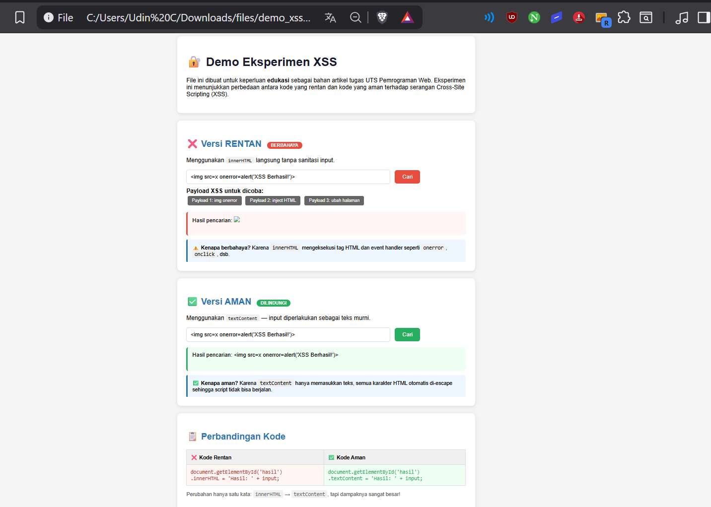

# 🔐 Cross-Site Scripting (XSS) — Eksperimen Keamanan Web

> Repositori ini dibuat sebagai bagian dari **Tugas UTS Pemrograman Web**
---

## 📋 Deskripsi

Cross-Site Scripting (XSS) adalah salah satu kerentanan keamanan web paling umum yang masuk dalam **OWASP Top 10**. Proyek ini mendemonstrasikan secara langsung bagaimana serangan XSS bekerja dan bagaimana cara mitigasinya menggunakan HTML dan JavaScript murni — tanpa framework apapun.

---

## 🧪 Cara Menjalankan Eksperimen

Cukup:

1. Clone atau download repositori ini
```bash
git clone https://github.com/USERNAME/REPO-NAME.git
```

2. Buka file `demo_xss_eksperimen.html` langsung di browser (Chrome/Firefox)

3. Ikuti langkah eksperimen di bawah

---

## ⚔️ Eksperimen yang Dilakukan

### Tes 1 — Serangan XSS (Versi Rentan)

Di bagian **❌ Versi RENTAN**, klik tombol payload lalu klik **Cari**:

| Payload | Efek |
|--------|------|
| `` | Mengeksekusi JavaScript via event handler |
| `<b style=color:red>Inject HTML</b>` | Menyisipkan elemen HTML ke halaman |
| `<script>...</script>` | Menjalankan script berbahaya |

**Hasil:** Input langsung dirender sebagai HTML karena menggunakan `innerHTML` tanpa sanitasi.

---

### Tes 2 — Mitigasi XSS (Versi Aman)

Di bagian **✅ Versi AMAN**, coba payload yang sama:

**Hasil:** Semua payload ditampilkan sebagai **teks literal** — tidak ada yang dieksekusi. Ini karena menggunakan `textContent`.

---

## 🛡️ Metode Mitigasi yang Diimplementasikan

### 1. `textContent` vs `innerHTML`

```javascript
// ❌ BERBAHAYA — mengeksekusi HTML/JS dari input
document.getElementById('hasil').innerHTML = 'Hasil: ' + input;

// ✅ AMAN — input diperlakukan sebagai teks murni
document.getElementById('hasil').textContent = 'Hasil: ' + input;
```

### 2. Fungsi Escape HTML

```javascript
function escapeHTML(str) {
  return str
    .replace(/&/g, '&amp;')
    .replace(/</g, '&lt;')
    .replace(/>/g, '&gt;')
    .replace(/"/g, '&quot;')
    .replace(/'/g, '&#x27;');
}
```

### 3. Content Security Policy (CSP)

```html
<meta http-equiv="Content-Security-Policy"
  content="default-src 'self'; script-src 'self'">
```

---

## 📊 Hasil Eksperimen




--
